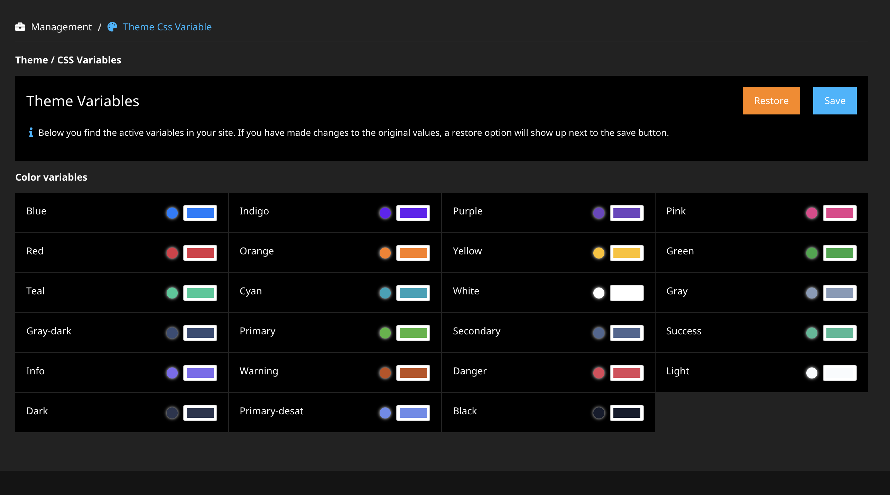

# Theme Css Variables
⚠️ This package is experimental! Use at your own risk!

## What is does...
This [Neos](https://neos.io) package provides a backend module giving users with access to the module
to create a custom stylesheet with CSS custom properties (a.k.a. CSS-variables) based on the 
custom properties that are found in the Public folder of the site.

The custom stylesheet is then loaded after the defined stylesheets via Fusion (so it is configurable if loading doesn't 
work out of the box). 

The result? A custom version of the website 😉.

The application tries to make an educated guess on the type of variable (color, font, breakpoint).
Each of those can be enabled via the `Settings.yaml`. (See below).



### What happens in the background?
The module reads all CSS files and extracts all variables declared inside the `:root` selector.
If multiple files are found (for example when using a bootstrap based theme) the array of variables
get merged where the top level file is considered to be the most relevant one. 

When you change the values a new css file is being created and store inside the `Data/Persistent/Theme/CssVariables` folder.
It is then symlinked inside the Public resources folder of the Theme.CssVariables package.

It is loaded as well, if it exists, and is merged as last so the module shows the active settings
for the variables.

Optionally you can restore the defaults by removing the file.

## Installation

Install by running:
```$bash
composer require theme/cssvariables
```

## Configuration

### Settings
| Setting  | Default value  | Explanation  |
|---|---|---|
|  stylesheetName | `custom.css`  | The name of the file to be generated.  |
|  types | `- color`  | Supported are: `color`,`font`,`breakpoint`,`other`. Where `other` means every variable we could not sensibly map to one of the others. |

### Fusion
Default the newly created CSS-file is placed with `@position = 'after stylesheets'`. 
If your Neos Page setup is different, make sure the file is loaded after your Site's css files.

### Access to the module
Our default policy is set for `Neos Administrators` only. However feel free to copy-paste the 
contents to your site package Policy.yaml and change it to whatever role you deem necessary.

Please be aware of one thing though: if more then one user can change the variables they need not be surprised
when some of the other users might pick a color they think is 💩!

## FAQ

### My css doesn't use CSS custom properties, can I still use this package?
Lot's of sites are build using SCSS and the Sass variables (i.e. `$primary-color`). 
When compiling the CSS the variable is substituted by it's value, and not like with the 
css custom properties as a reference. The result is hardcoded values and renders changing
the CSS custom properties kinda useless...

**But...** before we forget about the fun: there is an experimental feature that reads
your compiled css file and looks for all values that could be substituted by a reference.
You can try it out by running `./flow theme:replaceColorVariables`. 

As you guessed by the name, we currently only support substitution of variables that are considered
to be color references. (Mainly for stability reasons).

A backup of your original CSS file is created, so feel free to give it a try!

### Something is not working as expected, what should I do?
If you run into any issues, feel free to create a pull request or raise an issue. Please be as specific as possible and then a litte more... 😉
